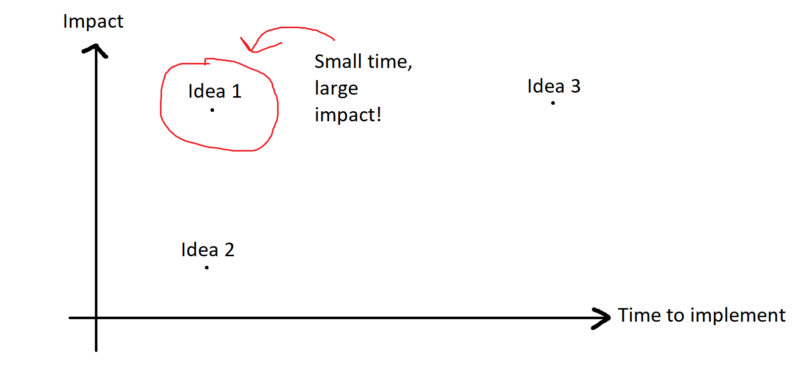

# Corona-hack 2020

In this time when all our events have been closed, lets have a fun event that hopefully will make some good relations across students, classes, mentros and alumni. 

The hackathon will be focused not on developing an app, but on coming up with an idea and further develop this idea. If you find time to develop something that is awesome, but it is absolutely not expected!! 

The mentors and the alumni that has joined is going to be a part of the groups just like everyone else. There will be no one functioning as "mentors" in the groups, but Benjamin, Marie and Daniel will work as facilitators. That means if you have any questions reach out to us! 

The groups can be [found here](groups.md). If someone is missing a group it is a mistake and please reach out

The normal curriculum will be pushed 1 week.

## Schedule
The schedule is approximate times. It should used as a rough guide of how to progress through the day :) 

- **12:00 - 12:15** - Introduction of team members + find a groupname 
- **12:15 - 13:00** - [Brainstorm](#brainstorm)
- **13:00 - 13:30** - [Idea selection](#idea-selection)
- **13:30 - 14:00** - [Idea formulation](#idea-formulation)
- **14:00 - 14:30** - Break
- **14:30 - 15:00** - [Wireframes](#wireframes)
- **15:00 - 15:30** - [User stories](#user-stories)
- **15:30 - 16:00** - [MVP](#mvp-minimal-viable-product)

### So what is my homework? 
The homework is to finish the [group handin](#group-handin). If you are already done with that on the Sunday, then continue working on the idea! Maybe adding user stories, improving the wireframes, implementing some functionality, its kind of up to you!

### Brainstorm
Come up with lots of ideas!
  - Set a timer
  - Write everything down
  - Yes and. No critism

### Idea selection
Come up with two parameters that is relevant for your idea. That could be fx impact vs time to implement.

Now draw the two parameters on a xy axis. Plot the different ideas from your brainstorming session on the graph. Use this tool to help you choose the idea! 

### Idea formulation
With the idea that you selected, make an idea formulation describing the idea.

Please include both these types of descriptions
  - We want to build X for Y that solves problem Z
  - Write a short description of the idea (about 10 lines or more) that describes these things:
    - What problem/problems are you solving?
    - Who are the users?
    - What exactly should the app do?

### Wireframes
Using the Idea/Problem formulation to make wireframes 
  - Do it as simple as you can! Maybe pen and paper and then take pictures of it. Maybe shared whiteboard, you decide. 

### User stories
- With the wireframes make user stories for the most important functionality 
  - As a < type of user >, I want < some goal > so that < some reason >
  - As a user, I can indicate folders not to backup so that my backup drive isn't filled up with things I don't need saved.

### MVP - Minimal Viable Product
With the user stories make an MVP

## Group handin
What would be required to hand in is:
1. Idea formulation
2. At least two wireframes
3. At least one user story
4. Next steps

## Preparation
Here are some articles/videoes you can use to prepare :ballot_box_with_check:
https://www.rightsourcemarketing.com/content-marketing/editorial-calendar-stress-content-brainstorm-could-spell-relief/
https://medium.com/@gtabidze/describe-your-idea-framework-2bfca3dc6ec9
https://careerfoundry.com/en/blog/ux-design/how-to-create-your-first-wireframe/
https://www.mountaingoatsoftware.com/agile/user-stories
https://www.youtube.com/watch?v=joNKkWPafZs

## Picking a winner
We will make a panel that will pick the best idea based on these goals

- Does the idea solve a real problem
- Is the idea clearly explained

